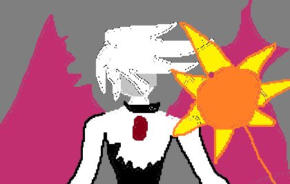

# Karna

Karna is a modern framework to build 2d games.
Built entirely in Rust, aims to be the rust replacement for love2D, for high performace 2D (and maybe 3D) games!

  

## Features

- Easy to use, but also scalable for creating large projects
- Lightweight binary without any library files shipped with it
- Fast and memory efficient text rendering with [`fontdue`](https://github.com/mooman219/fontdue) (even fast-changing multicolored text!)
- Fast image loading with the [`image`](https://github.com/image-rs/image) crate
- Sounds via the [`rodio`](https://github.com/RustAudio/rodio) crate

- [ ] Portable to other platforms apart from computers (consoles and mobiles)
- [ ] 3D space and rendering

## ⚠️⚠️
Karna is its VERY EARLY stage of development, so many breaking changes and rewrites WILL occur.

## Dependencies

- SDL2 (no SDL_image, SDL_ttf, etc.)
- fontdue
- rodio
- image

## Contributing

Feel free to open up a pull request or raise an issue!

## License

MIT License (c) 2024 Saverio Scagnol
